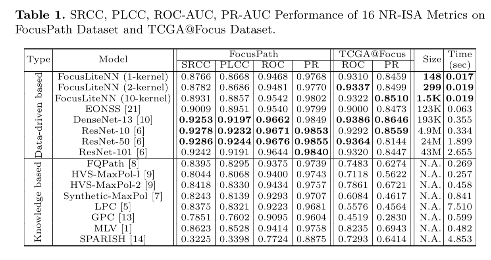

## FocusLiteNN

This is the official PyTorch and MATLAB implementations of our MICCAI 2020 paper "FocusLiteNN: High Efficiency Focus Quality Assessment for Digital Pathology".

### 1. Brief Introduction

#### 1.1 Model

#### 1.2 Results

#### 1.3 Citation

@InProceedings{wang2020focuslitenn,
    title={FocusLiteNN: High Efficiency Focus Quality Assessment for Digital Pathology},
    author={Z. Wang and M. Hosseini and A. Miles and Z. Wang and K. Plataniotis},
    booktitle={Medical Image Computing and Computer Assisted Intervention (MICCAI)},
    year={2020},
    publisher="Springer International Publishing"
}

### 2. Dataset

#### 2.1. [TCGA@Focus](https://zenodo.org/record/3910757#.Xve1MXX0kUe)

    - **Download**: The dataset is available on Zenodo under a Creative Commons Attribution license: .
    - **Content**: Contains 14371 pathological images with in/out focus labels.
    - **Testing**: This is the testing dataset proposed and used in the paper. The specific testing images can be found in `data/TCGA@Focus.txt`

#### 2.2 [Focuspath Extended](https://sites.google.com/view/focuspathuoft/home)

   - **Download**: TODO
   - **Content**:Contains 8640 pathological images of different blur levels.
   - **Training**: This is the training dataset used in the paper. The specific training images in one of the ten folds can be found in `data/FocusPath_full_split1.txt`

### 3. Prerequest

#### 3.1 Environment

#### 3.2 Pretrained Models

  - Pretrained models could be found in folder `pretrained_model/`
  - Pretrained models for ResNet10, ResNet50 and ResNet101 are available for download at [Download Link](https://drive.google.com/drive/folders/1TuvR7iHzatriHNndClMxMwiKRmxOShWr?usp=sharing). The downloaded models should be put under `pretrained_model/`

### 4. Running the code

The following are basic usage of the code, for more options, please refer to the code.

#### 4.1 Python Demo for testing a single image (heatmap available)

`python demo.py --arch FocusLiteNN-1kernel --img imgs/TCGA@Focus_patch_i_9651_j_81514.png`

#### 4.2 MATLAB Demo for testing a single image (non-efficient implementation)

run `matlab/FocusLiteNN-1kernel.m`

#### 4.3 Training FocusLiteNN on [Focuspath_full](https://sites.google.com/view/focuspathuoft/home)

- Download the Focuspath_full dataset and put it under `data/`
- Basic usage: `python train_model.py --use_cuda True --arch FocusLiteNN --num_channel 1 --trainset data/FocusPath_full --train_csv data/FocusPath_full_split1.txt`

#### 4.4 Testing FocusLiteNN on [TCGA@Focus](https://zenodo.org/record/3910757#.Xve1MXX0kUe)

- Download the TCGA@Focus dataset and put it under `data/`
- Basic usage: `python test_model.py --use_cuda True --arch FocusLiteNN --num_channel 1 --testset data/TCGA@Focus --test_csv data/TCGA@Focus.txt`
